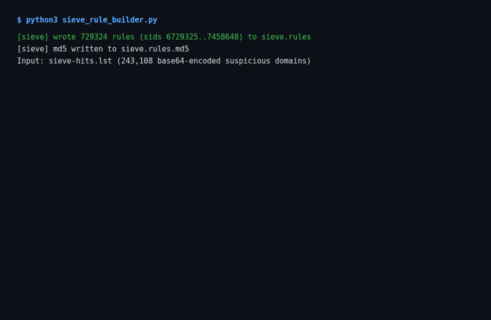
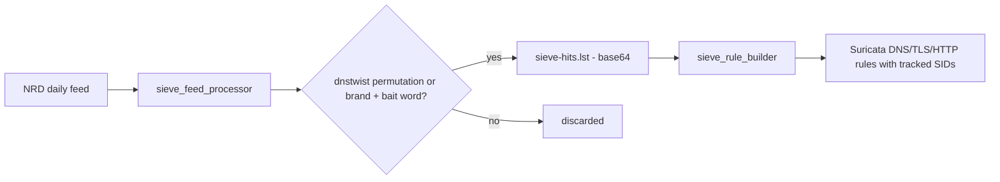

# DomainSieve

[](https://github.com/boluwajioadepojuw/DomainSieve/actions/workflows/ci.yml)

A phishing-domain sieve for a small SOC: every day it downloads the Newly
Registered Domains feed, keeps the domains that look like brand
impersonation, and turns them into Suricata rules the gateway can load.

## How it works

1. sieve_feed_processor.py downloads the daily NRD list and builds a
dnstwist permutation set of the watched brands (banks, crypto, big
consumer brands).
2. A domain is kept when it matches a permutation, or when it carries a
brand name plus a bait word (login, verify, billing, support...), or
when its leetspeak form decodes to a brand.
3. sieve_rule_builder.py reads the hit list and writes DNS / TLS / HTTP
Suricata rules with tracked SIDs (6000002 and up) into sieve.rules,
plus an md5 for the distribution pipeline.

Output files: sieve-nrd-domains.txt (plain sample), sieve-hits.lst
(base64, generated - gitignored), sieve.rules + sieve.rules.md5 (for the
gateway). Run the two scripts to regenerate the full artifact set from
the live feed.

Note on scale: 243k domains expand to 729k rules. For a home gateway,
cap the hit list (head -n N on sieve-hits.lst) or raise the dnstwist
threshold before building - the pipeline is one pass, so tuning is a
single parameter change.

## Screenshot

Rule build from the live hit list (243k domains -> 729k rules):



## Why this shape

One feed, one pass, three rule types. No dashboard, no API, no state
beyond the SID file - everything an L1 analyst can read in ten minutes
and everything a pfSense or OPNsense box can consume directly.

## Running it

```bash
pip install -r requirements.txt
python3 sieve_feed_processor.py      # fetch + classify
python3 sieve_rule_builder.py        # emit Suricata rules
./check-rule-url.sh                  # verify one rule URL, optional
```

See docs/sample-run.txt for a real run against the feed.

## Related projects

- [SOCAtelier](https://github.com/boluwajioadepojuw/SOCAtelier) - the SOC lab whose gateway loads these rules
- [SigScope](https://github.com/boluwajioadepojuw/SigScope) - ATT&CK coverage gate for the Sigma rules behind the detections
- [SplunkHarbor](https://github.com/boluwajioadepojuw/SplunkHarbor) - Splunk ingestion for the same telemetry
- [IocVerdict](https://github.com/boluwajioadepojuw/IocVerdict) - IOC enrichment for the indicators these rules surface
- [ArpSieve](https://github.com/boluwajioadepojuw/ArpSieve) - ARP spoofing detection on the local segment

## Author

Boluwaji Oluwaseyi Adepoju

## Data flow


